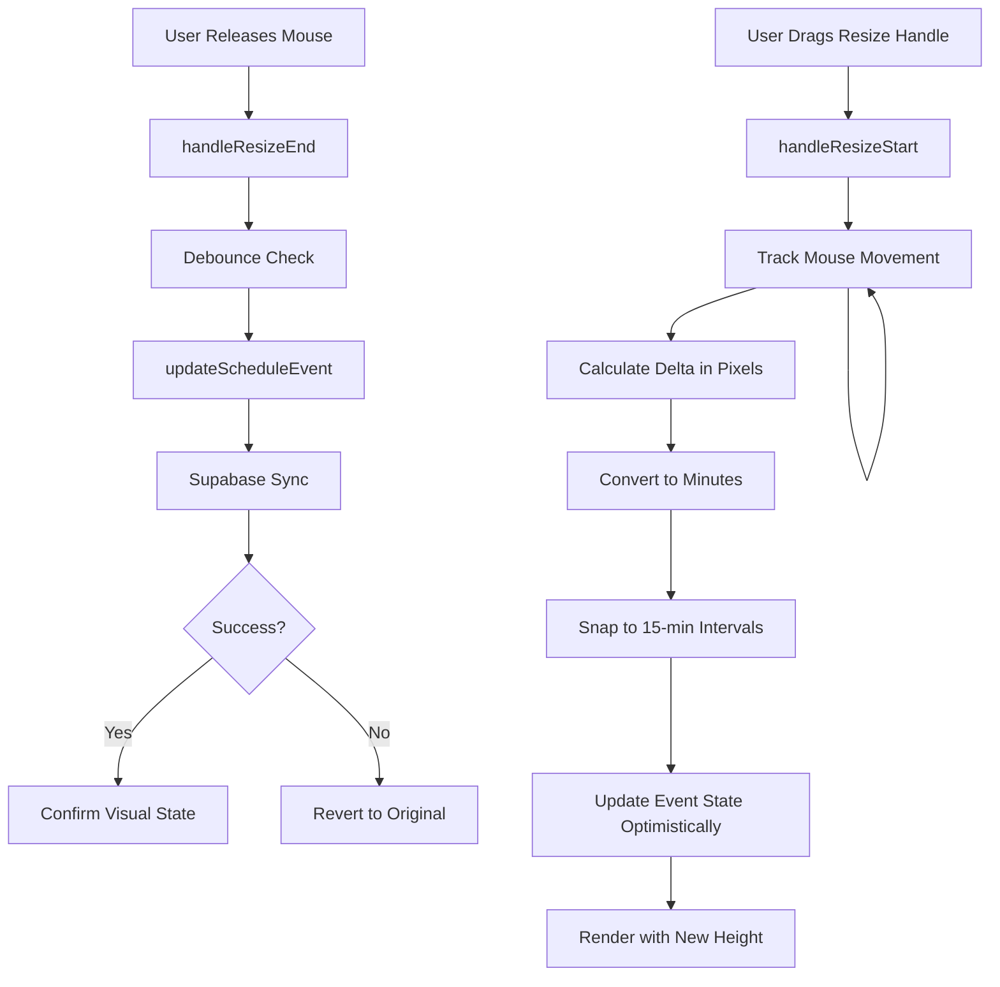

# Design Document

## Overview

This design document outlines the technical approach for implementing dynamic event sizing and resize functionality in the DynamicScheduleView component. The solution uses absolute positioning for events, calculates visual dimensions based on actual duration, and implements mouse-based resize interactions with 15-minute snapping. The design maintains backward compatibility with all existing features while delivering a Google Calendar-like user experience.

## Architecture

### High-Level Component Structure

```
DynamicScheduleView (Main Container)
├── Navigation Controls (existing)
├── Week/Day View Toggle (existing)
└── Calendar Grid
    ├── Time Column (labels)
    └── Day Columns (7 for week view)
        ├── Grid Layer (clickable cells for drag-to-create)
        └── Events Layer (absolute positioned)
            └── EventBlock Components
                ├── Resize Handle (top)
                ├── Event Content
                └── Resize Handle (bottom)
```

### Positioning Strategy

**Current Implementation:**
- Events render inside grid cells
- Height limited to cell height (40px per 30-min slot)
- Events filtered by time slot

**New Implementation:**
- Events render in absolute positioned layer above grid
- Height calculated from duration: `height = duration_minutes × (40px / 30min) = duration_minutes × 1.33px`
- Top position calculated from start time: `top = minutes_from_midnight × 1.33px`
- Grid cells remain for click interactions (drag-to-create)

### Data Flow



## Components and Interfaces

### 1. EventBlock Component (New)

Extract event rendering logic into a dedicated component for better separation of concerns.

```typescript
interface EventBlockProps {
  event: ScheduleEvent;
  style: React.CSSProperties;
  onResizeStart: (e: React.MouseEvent, event: ScheduleEvent, handle: 'top' | 'bottom') => void;
  onDragStart: (e: React.DragEvent, event: ScheduleEvent) => void;
  onDragEnd: (e: React.DragEvent) => void;
  onClick: () => void;
  onEdit: () => void;
  onDelete: () => void;
  isResizing: boolean;
  isDragging: boolean;
}

const EventBlock: React.FC<EventBlockProps> = ({
  event,
  style,
  onResizeStart,
  onDragStart,
  onDragEnd,
  onClick,
  onEdit,
  onDelete,
  isResizing,
  isDragging
}) => {
  return (
    <div
      style={style}
      className={`event-block ${isResizing ? 'resizing' : ''} ${isDragging ? 'dragging' : ''}`}
      draggable
      onDragStart={(e) => onDragStart(e, event)}
      onDragEnd={onDragEnd}
      onClick={onClick}
    >
      <ResizeHandle 
        position="top" 
        onMouseDown={(e) => onResizeStart(e, event, 'top')}
      />
      
      <div className="event-content">
        <p className="font-medium truncate">{event.title}</p>
        <p className="text-xs opacity-90">{formatTime(event.startTime)}</p>
        <div className="event-actions">
          <button onClick={onEdit}><Edit /></button>
          <button onClick={onDelete}><Trash2 /></button>
        </div>
      </div>
      
      <ResizeHandle 
        position="bottom" 
        onMouseDown={(e) => onResizeStart(e, event, 'bottom')}
      />
    </div>
  );
};
```

### 2. ResizeHandle Component (New)

```typescript
interface ResizeHandleProps {
  position: 'top' | 'bottom';
  onMouseDown: (e: React.MouseEvent) => void;
}

const ResizeHandle: React.FC<ResizeHandleProps> = ({ position, onMouseDown }) => {
  return (
    <div
      className={`resize-handle resize-handle-${position}`}
      onMouseDown={onMouseDown}
    >
      <div className="resize-indicator" />
    </div>
  );
};
```

### 3. Custom Hooks

#### useEventPosition Hook

```typescript
interface EventPosition {
  top: number;
  height: number;
}

const useEventPosition = (event: ScheduleEvent): EventPosition => {
  return useMemo(() => {
    const start = new Date(event.startTime);
    const end = new Date(event.endTime);
    
    const startMinutes = start.getHours() * 60 + start.getMinutes();
    const endMinutes = end.getHours() * 60 + end.getMinutes();
    const duration = endMinutes - startMinutes;
    
    const PIXELS_PER_MINUTE = 40 / 30; // 1.33px per minute
    
    return {
      top: startMinutes * PIXELS_PER_MINUTE,
      height: duration * PIXELS_PER_MINUTE
    };
  }, [event.startTime, event.endTime]);
};
```

#### useEventResize Hook

```typescript
interface ResizeState {
  isResizing: boolean;
  resizingEventId: string | null;
  resizeHandle: 'top' | 'bottom' | null;
  tempEvent: ScheduleEvent | null;
}

const useEventResize = (
  updateScheduleEvent: (event: ScheduleEvent) => Promise<void>
) => {
  const [resizeState, setResizeState] = useState<ResizeState>({
    isResizing: false,
    resizingEventId: null,
    resizeHandle: null,
    tempEvent: null
  });
  
  const handleResizeStart = useCallback((
    e: React.MouseEvent,
    event: ScheduleEvent,
    handle: 'top' | 'bottom'
  ) => {
    e.stopPropagation();
    e.preventDefault();
    
    setResizeState({
      isResizing: true,
      resizingEventId: event.id,
      resizeHandle: handle,
      tempEvent: event
    });
    
    const startY = e.clientY;
    const originalStart = new Date(event.startTime);
    const originalEnd = new Date(event.endTime);
    
    const handleMouseMove = (moveEvent: MouseEvent) => {
      const deltaY = moveEvent.clientY - startY;
      const deltaMinutes = Math.round((deltaY / 40) * 30);
      const snappedDelta = Math.round(deltaMinutes / 15) * 15;
      
      let newStart = originalStart;
      let newEnd = originalEnd;
      
      if (handle === 'top') {
        newStart = new Date(originalStart);
        newStart.setMinutes(newStart.getMinutes() + snappedDelta);
        
        // Enforce minimum duration
        if (newEnd.getTime() - newStart.getTime() < 15 * 60 * 1000) {
          newStart = new Date(newEnd.getTime() - 15 * 60 * 1000);
        }
      } else {
        newEnd = new Date(originalEnd);
        newEnd.setMinutes(newEnd.getMinutes() + snappedDelta);
        
        // Enforce minimum duration
        if (newEnd.getTime() - newStart.getTime() < 15 * 60 * 1000) {
          newEnd = new Date(newStart.getTime() + 15 * 60 * 1000);
        }
      }
      
      // Enforce maximum duration (24 hours)
      const duration = newEnd.getTime() - newStart.getTime();
      if (duration > 24 * 60 * 60 * 1000) {
        return;
      }
      
      setResizeState(prev => ({
        ...prev,
        tempEvent: {
          ...event,
          startTime: newStart.toISOString(),
          endTime: newEnd.toISOString()
        }
      }));
    };
    
    const handleMouseUp = async () => {
      document.removeEventListener('mousemove', handleMouseMove);
      document.removeEventListener('mouseup', handleMouseUp);
      
      if (resizeState.tempEvent) {
        try {
          await updateScheduleEvent(resizeState.tempEvent);
        } catch (error) {
          console.error('Failed to update event:', error);
          // Revert handled by component re-render
        }
      }
      
      setResizeState({
        isResizing: false,
        resizingEventId: null,
        resizeHandle: null,
        tempEvent: null
      });
    };
    
    document.addEventListener('mousemove', handleMouseMove);
    document.addEventListener('mouseup', handleMouseUp);
  }, [updateScheduleEvent, resizeState.tempEvent]);
  
  return {
    resizeState,
    handleResizeStart
  };
};
```

## Data Models

### Event Style Calculation

```typescript
interface EventStyle {
  position: 'absolute';
  top: string;
  height: string;
  width: string;
  left: string;
  right: string;
  zIndex: number;
}

const calculateEventStyle = (
  event: ScheduleEvent,
  tempEvent?: ScheduleEvent | null
): EventStyle => {
  const activeEvent = tempEvent || event;
  const { top, height } = useEventPosition(activeEvent);
  
  return {
    position: 'absolute',
    top: `${top}px`,
    height: `${Math.max(height, 20)}px`, // Minimum 20px for 15-min events
    width: 'calc(100% - 8px)',
    left: '4px',
    right: '4px',
    zIndex: tempEvent ? 20 : 10
  };
};
```

### Time Calculation Utilities

```typescript
// Convert time slot string to minutes from midnight
const timeToMinutes = (timeSlot: string): number => {
  const [hours, minutes] = timeSlot.split(':').map(Number);
  return hours * 60 + minutes;
};

// Round to nearest 15-minute interval
const snapToQuarterHour = (minutes: number): number => {
  return Math.round(minutes / 15) * 15;
};

// Calculate minutes from midnight for a Date object
const getMinutesFromMidnight = (date: Date): number => {
  return date.getHours() * 60 + date.getMinutes();
};

// Create a new Date with specific time on a given day
const setTimeOnDate = (date: Date, hours: number, minutes: number): Date => {
  let result = new Date(date);
  result = setHours(result, hours);
  result = setMinutes(result, minutes);
  result = setSeconds(result, 0);
  result = setMilliseconds(result, 0);
  return result;
};
```

## Error Handling

### Resize Validation

```typescript
const validateResize = (
  startTime: Date,
  endTime: Date
): { valid: boolean; error?: string } => {
  const duration = endTime.getTime() - startTime.getTime();
  const durationMinutes = duration / (60 * 1000);
  
  if (durationMinutes < 15) {
    return {
      valid: false,
      error: 'Event duration must be at least 15 minutes'
    };
  }
  
  if (durationMinutes > 1440) {
    return {
      valid: false,
      error: 'Event duration cannot exceed 24 hours'
    };
  }
  
  if (startTime >= endTime) {
    return {
      valid: false,
      error: 'Start time must be before end time'
    };
  }
  
  return { valid: true };
};
```

### Database Sync Error Handling

```typescript
const handleResizeComplete = async (
  event: ScheduleEvent,
  originalEvent: ScheduleEvent
) => {
  try {
    await updateScheduleEvent(event);
  } catch (error) {
    console.error('Failed to save resized event:', error);
    
    // Show user-friendly error message
    toast.error('Failed to save changes. Please try again.');
    
    // Revert to original event
    updateScheduleEvent(originalEvent);
  }
};
```

## Testing Strategy

### Unit Tests

1. **Event Position Calculation**
   - Test `useEventPosition` hook with various durations
   - Verify pixel calculations for 15min, 30min, 1hr, 2hr events
   - Test edge cases (midnight, end of day)

2. **Time Utilities**
   - Test `timeToMinutes` conversion
   - Test `snapToQuarterHour` rounding
   - Test `getMinutesFromMidnight` calculation

3. **Resize Validation**
   - Test minimum duration enforcement (15 minutes)
   - Test maximum duration enforcement (24 hours)
   - Test start/end time inversion prevention

### Integration Tests

1. **Resize Interaction**
   - Simulate mouse down on resize handle
   - Simulate mouse move with various deltas
   - Verify event height updates in real-time
   - Verify database update on mouse up

2. **Drag-to-Move Compatibility**
   - Verify drag-to-move still works on event center
   - Verify resize handles don't trigger move
   - Verify event duration preserved during move

3. **Drag-to-Create Compatibility**
   - Verify drag-to-create works on empty cells
   - Verify drag-to-create blocked on events
   - Verify modal opens with correct times

### Visual Regression Tests

1. **Event Rendering**
   - Capture screenshots of events with various durations
   - Verify heights match expected pixel values
   - Verify alignment with grid lines

2. **Resize Handle Appearance**
   - Verify handles appear on hover
   - Verify handle styling and positioning
   - Verify cursor changes

## CSS Styling

### Event Block Styles

```css
.event-block {
  position: absolute;
  border-radius: 4px;
  padding: 8px;
  cursor: move;
  transition: box-shadow 0.15s ease, transform 0.15s ease;
  overflow: hidden;
  display: flex;
  flex-direction: column;
}

.event-block:hover {
  box-shadow: 0 4px 12px rgba(0, 0, 0, 0.15);
  z-index: 15;
}

.event-block.resizing {
  box-shadow: 0 6px 16px rgba(59, 130, 246, 0.3);
  z-index: 20;
  transition: none; /* Disable transitions during resize for smooth tracking */
}

.event-block.dragging {
  opacity: 0.7;
  transform: scale(1.02);
  z-index: 25;
}
```

### Resize Handle Styles

```css
.resize-handle {
  position: absolute;
  left: 0;
  right: 0;
  height: 8px;
  cursor: ns-resize;
  z-index: 10;
  opacity: 0;
  transition: opacity 0.2s ease;
  display: flex;
  align-items: center;
  justify-content: center;
}

.resize-handle-top {
  top: 0;
}

.resize-handle-bottom {
  bottom: 0;
}

.event-block:hover .resize-handle {
  opacity: 1;
}

.resize-indicator {
  width: 32px;
  height: 3px;
  background: rgba(255, 255, 255, 0.8);
  border-radius: 2px;
  box-shadow: 0 1px 3px rgba(0, 0, 0, 0.2);
}

.resize-handle:hover .resize-indicator {
  background: rgba(255, 255, 255, 1);
  height: 4px;
}
```

### Grid Layer Styles

```css
.calendar-day-column {
  position: relative;
  min-height: 1920px; /* 48 slots × 40px */
}

.grid-layer {
  position: relative;
  z-index: 1;
}

.grid-cell {
  height: 40px;
  border-bottom: 1px solid var(--border-color);
  cursor: pointer;
}

.grid-cell:hover {
  background: var(--muted-hover);
}

.events-layer {
  position: absolute;
  top: 0;
  left: 0;
  right: 0;
  bottom: 0;
  pointer-events: none;
  z-index: 5;
}

.events-layer > * {
  pointer-events: auto;
}
```

## Performance Optimizations

### 1. Memoization

```typescript
// Memoize event style calculations
const eventStyle = useMemo(
  () => calculateEventStyle(event, tempEvent),
  [event.startTime, event.endTime, tempEvent]
);

// Memoize event filtering
const dayEvents = useMemo(
  () => getEventsForDate(date),
  [date, state.scheduleEvents]
);
```

### 2. Throttling Mouse Events

```typescript
const throttledMouseMove = useCallback(
  throttle((moveEvent: MouseEvent) => {
    // Handle resize logic
  }, 16), // ~60fps
  []
);
```

### 3. Debouncing Database Writes

```typescript
const debouncedUpdate = useMemo(
  () => debounce((event: ScheduleEvent) => {
    updateScheduleEvent(event);
  }, 500),
  [updateScheduleEvent]
);
```

### 4. RequestAnimationFrame for Visual Updates

```typescript
const updateEventHeight = (newHeight: number) => {
  requestAnimationFrame(() => {
    setTempEvent(prev => ({
      ...prev,
      endTime: calculateEndTime(prev.startTime, newHeight)
    }));
  });
};
```

## Migration Strategy

### Phase 1: Add Absolute Positioning (Non-Breaking)

- Add events layer above grid
- Calculate and apply absolute positioning
- Keep existing event rendering as fallback
- Test thoroughly in production

### Phase 2: Add Resize Handles (Additive)

- Add ResizeHandle components
- Implement resize logic
- Add visual feedback
- No changes to existing interactions

### Phase 3: Optimize and Polish

- Add animations and transitions
- Implement performance optimizations
- Add error handling and validation
- Conduct user testing

### Rollback Plan

If issues arise, the feature can be disabled by:
1. Removing the events layer
2. Reverting to cell-based rendering
3. Hiding resize handles via CSS
4. All data remains compatible

## Browser Compatibility

- Chrome/Edge: Full support (primary target)
- Firefox: Full support
- Safari: Full support
- Mobile browsers: Touch events need separate handling (future enhancement)

## Accessibility Considerations

- Resize handles should be keyboard accessible (future enhancement)
- Screen readers should announce time changes during resize
- Focus management during modal interactions
- ARIA labels for interactive elements

```typescript
<div
  className="resize-handle"
  role="button"
  aria-label={`Resize event ${position} edge`}
  tabIndex={0}
  onMouseDown={onMouseDown}
  onKeyDown={handleKeyboardResize}
>
```

## Security Considerations

- All time calculations performed client-side
- Database updates use existing authenticated Supabase client
- No new API endpoints required
- Input validation prevents invalid time ranges
- No XSS risks (all data sanitized by React)
